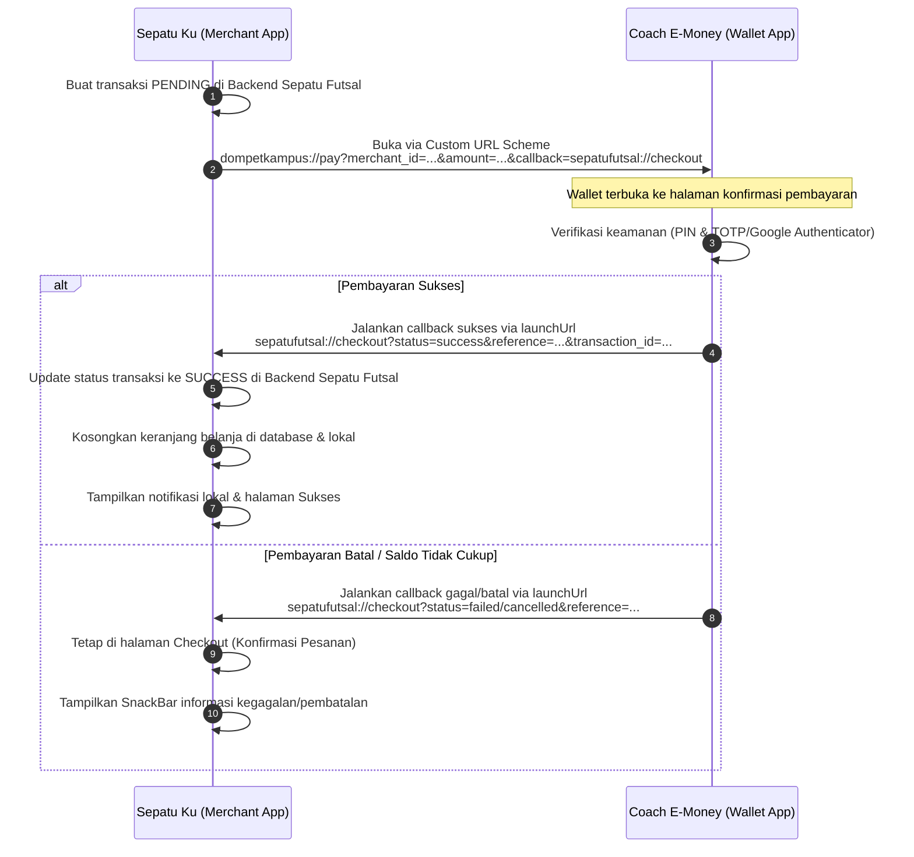

## Aplikasi E-money & E-commerce

 * Nama : Arya Pramudya Akbar
 * Nim : 1123150004
 * Jurusan : Teknik Informatika
 * Kelas : TI SE P1
 * Mata Kuliah : Pemrograman Mobile Lanjutan

## Arsitektur & Desain Sistem

Sistem ini terdiri dari dua aplikasi mobile (Flutter) yang saling terintegrasi secara dinamis menggunakan protokol **Deep Linking (Custom URL Schemes)**:
1. **Coach E-Money (Wallet App)**: Aplikasi dompet digital untuk pembayaran instan, top-up saldo, dan riwayat transaksi, dilengkapi keamanan PIN dan 2FA (TOTP/Google Authenticator).
2. **Sepatu Ku (E-Commerce App)**: Aplikasi katalog dan pembelian sepatu futsal dengan sistem keranjang belanja yang terhubung ke Coach E-Money sebagai metode pembayaran utama.

---

### 1. Arsitektur Kode (Clean Architecture)

Kedua aplikasi dibangun dengan prinsip **Clean Architecture** untuk memisahkan logika bisnis dari UI dan kerangka kerja (framework), namun menggunakan pendekatan folder yang berbeda untuk menyesuaikan kebutuhan skalabilitas:

#### A. Coach E-Money (`fe_emoney`) — *Layer-First Clean Architecture*
Aplikasi wallet ini menggunakan struktur berbasis lapisan (layer) secara global karena fiturnya terpusat pada satu domain finansial utama:
* **`core/`**: Menyimpan tema warna, konstanta global, router (`GoRouter`), dan layanan sistem (biometrik, deep link handler).
* **`domain/`**: Lapisan inti logika bisnis yang bersih (tidak memiliki dependensi eksternal):
  * **Entities**: Objek data bisnis murni (contoh: `User`, `Account`, `Transaction`).
  * **Repositories**: Kontrak/antarmuka (interface) untuk operasi data.
  * **Use Cases**: Alur spesifik logika aplikasi (contoh: `GetAccount`, `RequestTransfer`).
* **`data/`**: Implementasi dari antarmuka domain:
  * **Models**: Serialisasi JSON data dari/ke API backend Go.
  * **Data Sources**: Pengambilan data dari internet (Remote API) atau penyimpanan lokal (Secure Storage).
  * **Repositories**: Implementasi repositori domain untuk mengalirkan data ke use cases.
* **`presentation/`**: Berisi UI (`pages` dan `widgets`) serta manajemen status menggunakan **BLoC (Business Logic Component)** untuk memisahkan UI event dengan state data.
* **`injection/`**: Dependency injection terpusat menggunakan paket `get_it` (`injection_container.dart`).

**Visualisasi Struktur Folder `fe_emoney`:**
```text
fe_emoney/
└── lib/
    ├── core/
    │   ├── constants/       # Konstanta global (API endpoints, asset paths)
    │   ├── error/           # Definisi Exception & Failure handling
    │   ├── network/         # HTTP Client wrapper (Dio, interceptors)
    │   ├── router/          # Rute navigasi menggunakan GoRouter
    │   ├── services/        # Layanan sistem (biometrik, local auth)
    │   ├── theme/           # Palet warna, tipografi, & style UI
    │   └── utils/           # Fungsi utilitas bantu (date formatter, currency)
    ├── data/
    │   ├── datasources/     # Remote (API backend Go) & Local (Secure Storage)
    │   ├── models/          # Deserialisasi JSON data model
    │   └── repositories/    # Implementasi repositori domain
    ├── domain/
    │   ├── entities/        # Objek data bisnis murni (User, Account, Transaction)
    │   ├── repositories/    # Kontrak/interface repositori data
    │   └── usecases/        # Logika bisnis usecase (Transfer, Topup, GetAccount)
    ├── injection/
    │   └── injection_container.dart # Setup GetIt Service Locator
    ├── presentation/
    │   ├── blocs/           # Manajemen status aplikasi (AuthBloc, PaymentCubit, dll.)
    │   ├── pages/           # Halaman UI (Home, Login, Pin, TransactionHistory, dll.)
    │   └── widgets/         # Komponen UI reusable (Button, TextField, Card, dll.)
    └── main.dart            # Entry point aplikasi
```

#### B. Sepatu Ku (`uts_1123150004`) — *Feature-First Clean Architecture*
Aplikasi e-commerce menggunakan struktur berbasis fitur (feature-first) agar pengembangan lebih modular dan mudah dikembangkan oleh tim paralel:
* **`core/`**: Berisi konfigurasi jaringan (`DioClient`), rute statis, penyimpanan lokal, dan gaya aplikasi.
* **`features/`**: Folder modular untuk setiap kelompok fitur:
  * **`auth/`** (Autentikasi & Registrasi)
  * **`cart/`** (Keranjang Belanja & Checkout)
  * **`dashboard/`** (Katalog Produk, Profil, & Riwayat Transaksi)
* Setiap fitur di atas dipecah kembali ke dalam lapisan Clean Architecture:
  * **`domain/`** (Entities, Repositories, Usecases)
  * **`data/`** (Models, Data Sources, Repositories)
  * **`presentation/`** (Pages, Widgets, dan **Providers** untuk manajemen status).

**Visualisasi Struktur Folder `uts_1123150004`:**
```text
uts_1123150004/
└── lib/
    ├── core/
    │   ├── constants/       # Konstanta (API endpoint, assets)
    │   ├── guards/          # Route guards (misal: AuthGuard)
    │   ├── routes/          # Konfigurasi static routes navigasi
    │   ├── services/        # Layanan sistem (local notifications, deep links)
    │   ├── theme/           # Desain sistem & style UI
    │   └── widgets/         # Komponen UI global (Navbar, LoadingIndicator)
    ├── features/            # Fitur aplikasi modular
    │   ├── auth/            # Fitur Autentikasi
    │   │   ├── data/        # Model & data source login/register
    │   │   ├── domain/      # Entitas & logika autentikasi
    │   │   └── presentation/# Halaman Login/Register & AuthProvider
    │   ├── cart/            # Fitur Keranjang & Checkout
    │   │   ├── data/        # Model item keranjang & checkout request
    │   │   ├── domain/      # Logika perhitungan keranjang & interface checkout
    │   │   └── presentation/# CheckoutPage, CartPage & CartProvider
    │   └── dashboard/       # Fitur Dashboard / Halaman Utama
    │       ├── data/        # Model produk & riwayat pesanan
    │       ├── domain/      # Logika filter katalog & interface pesanan
    │       └── presentation/# DashboardPage, HistoryPage & ProductProvider
    └── main.dart            # Entry point aplikasi
```

---

### 2. Manajemen Status & Dependensi (State Management)

* **Coach E-Money (`fe_emoney`)**: Menggunakan **BLoC / Cubit** (`flutter_bloc`). Pendekatan ini dipilih untuk menjaga aliran data finansial yang ketat, mempermudah pelacakan state (seperti `PaymentLoading`, `PaymentSuccess`, `PaymentInsufficientBalance`), serta mempermudah pengujian unit (unit testing) logika bisnis.
* **Sepatu Ku (`uts_1123150004`)**: Menggunakan **Provider** (`provider`). Pendekatan ini lebih sederhana dan cepat untuk aplikasi e-commerce yang berfokus pada sinkronisasi status UI seperti jumlah item keranjang (`CartProvider`) secara real-time.

---

### 3. Protokol Integrasi & Deep Linking (Cross-App Flow)

Komunikasi antara aplikasi e-commerce dan e-money dilakukan secara dua arah (bidirectional) di atas sistem operasi Android/iOS:



#### Keamanan dan Konfigurasi Native Penting yang Telah Dioptimalkan:
1. **Package Visibility (`<queries>` di Android Manifest)**:
   Agar aplikasi wallet dapat memanggil skema `sepatufutsal://` kembali pada Android 11+, skema kustom merchant dideklarasikan di dalam tag `<queries>` manifes wallet, menjamin callback lancar tanpa diblokir OS.
2. **Task Stack Isolation (`launchMode="singleTask"`)**:
   `MainActivity` pada kedua aplikasi dikonfigurasi menggunakan `singleTask` agar ketika callback deep link dijalankan, Android tidak membuat instance baru dari aplikasi target, melainkan mengaktifkan instance yang sudah ada di background dan menjaga tumpukan halaman checkout (`CheckoutPage`) tetap utuh.
3. **Manual Deep Link Routing (`flutter_deeplinking_enabled="false"`)**:
   Manifes aplikasi e-commerce dikonfigurasi untuk mematikan navigasi otomatis bawaan Flutter untuk deep links, sehingga tautan `sepatufutsal://checkout` dan `sepatufutsal://connect` dapat diproses secara manual dan aman oleh paket `app_links` tanpa mereset navigasi pengguna kembali ke Splash/Home.
4. **Isolasi Dialog Global**:
   Pengecekan dialog aktif (`_isConnectDialogOpen`) pada tab Profile mencegah tab background memanggil `Navigator.pop` secara tidak sengaja yang dapat merusak tumpukan halaman checkout saat proses penghubungan e-money berhasil dilakukan.